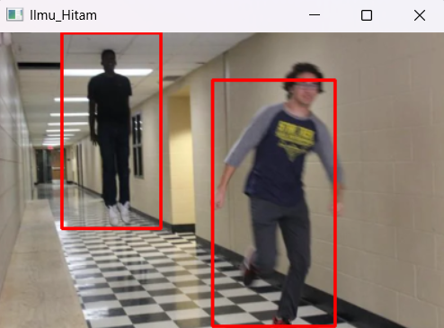

# Praktikum 15: Citra Deteksi jalan

## Nama: Albhani Fadillah Haryady
## NIM: 312410130
## Kelas: I241A


### program untuk mendeteksi pejalan kaki dalam sebuah gambar
```python
import cv2
import imutils

# Menginisialisasi orang HOG detektor
hog = cv2.HOGDescriptor()
hog.setSVMDetector(cv2.HOGDescriptor_getDefaultPeopleDetector())

# Membaca Gambar
image = cv2.imread('Walk.webp')

# Mengubah ukuran gambar
image = imutils.resize(image, width=min(400, image.shape[1]))

# Mendeteksi semua wilayah di Gambar yang memiliki pejalan kaki di dalamnya
(regions, _) = hog.detectMultiScale(image, winStride=(4, 4), padding=(4, 4), scale=1.05)

# Menggambar wilayah dalam Gambar
for (x, y, w, h) in regions:
    cv2.rectangle(image, (x, y), (x + w, y + h), (0, 0, 255), 2)

# Menampilkan Gambar keluaran
cv2.imshow("Ilmu_Hitam", image)
cv2.waitKey(0)
cv2.destroyAllWindows()
```


### program untuk mendeteksi pejalan kaki dalam sebuah gambar
```python
import cv2
import imutils

# Menginisialisasi orang HOG detektor
hog = cv2.HOGDescriptor()
hog.setSVMDetector(cv2.HOGDescriptor_getDefaultPeopleDetector())

cap = cv2.VideoCapture('walk.mp4')

# Mendapatkan properti video asli
fps = int(cap.get(cv2.CAP_PROP_FPS))
width = 400
height = int(cap.get(cv2.CAP_PROP_FRAME_HEIGHT) * (400 / cap.get(cv2.CAP_PROP_FRAME_WIDTH)))

# Menentukan kodec dan membuat VideoWriter untuk menyimpan hasil
fourcc = cv2.VideoWriter_fourcc(*'mp4v')
out = cv2.VideoWriter('output_video.mp4', fourcc, fps, (width, height))

while cap.isOpened():
    # Membaca streaming video
    ret, image = cap.read()
    if ret:
        image = imutils.resize(image, width=min(400, image.shape[1]))
        
        # Mendeteksi semua wilayah dalam Gambar yang memiliki pejalan kaki di dalamnya
        (regions, _) = hog.detectMultiScale(image, winStride=(4, 4), padding=(4, 4), scale=1.05)
        
        # Menggambar wilayah di Gambar
        for (x, y, w, h) in regions:
            cv2.rectangle(image, (x, y), (x + w, y + h), (0, 0, 255), 2)
        
        # Menyimpan frame ke video output
        out.write(image)
        
        # Menampilkan Gambar keluaran
        cv2.imshow("walking video", image)
        if cv2.waitKey(25) & 0xFF == ord('q'):
            break
    else:
        break

cap.release()
out.release()
cv2.destroyAllWindows()
```
https://github.com/user-attachments/assets/53731004-a035-4363-a8b6-089c4d035591
